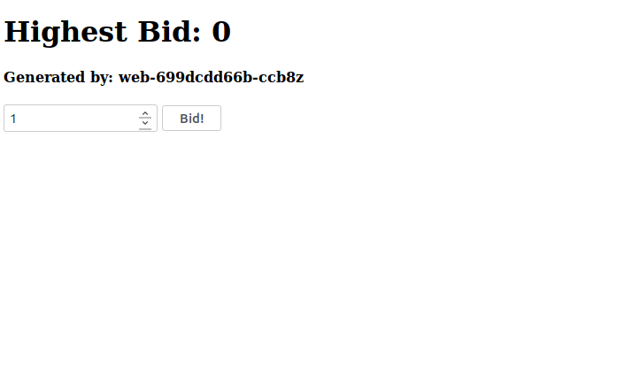

# Networking: Ingress

In all previous excercies we accessed our cluster from within the cluster. To receive traffic from outside, we somehow need to get it in. Kubernetes supports different [ingress controllers](https://kubernetes.io/docs/concepts/services-networking/ingress/#ingress-controllers).

## minikube

We use the Nginx Ingress Controller. It's installation is easy when using minikube. But before we installed it, let's check what happens if we call our minikube node:

Get the IP:

`minikube ip`

and then try to access that ip from your machine:

`curl -i <ip>`

Now lets install our ingress controller:

`minikube addons enable ingress`

This creates new pods. Wait until alle pods are running.

`kubectl get pods --all-namespaces`

Access the node again from your machine:

`curl -i <ip>`

**Important**: If you are using the docker driver, this does not work. You should port-forward your traffic to the ingress and not try to access the minikube ip. This is due to a limitation of Docker driver networking.

- What changed?
- What was deployed on your cluster? Check all running pods in your cluster: `kubectl get --all-namespaces pods`
- Where does the answer for your HTTP GET come from?

## AWS

We are using the AWS Load Balancer Controller. The controller is already installed.
You can find them using the following command:
`kubectl get pods -n kube-system`

## 1. Create an ingress resource

Let's add a route to our auction backend:

### minikube

```yaml
apiVersion: networking.k8s.io/v1
kind: Ingress
metadata:
  name: auction-ingress
  annotations:
    nginx.ingress.kubernetes.io/rewrite-target: /
spec:
  rules:
    - http:
        paths:
          - path: /
            pathType: Prefix
            backend:
              service:
                name: auction
                port:
                  number: 80
```

### AWS

```yaml
apiVersion: networking.k8s.io/v1
kind: Ingress
metadata:
  name: auction-ingress
  annotations:
    alb.ingress.kubernetes.io/scheme: internet-facing
    alb.ingress.kubernetes.io/target-type: instance
spec:
  ingressClassName: alb
  rules:
    - http:
        paths:
          - path: /
            pathType: Prefix
            backend:
              service:
                name: auction
                port:
                  number: 80
```

Now if you connect with your browser to the minikube ip or use the aws ingress address for (`kubectl get ingress`) you should see the auction app again:



- What happens if you configured a wrong backend?
- Can you access the ingress ressource from outside of the cluster?
- Can you access the ingress ressource from inside the cluster?
- Try to draw a short diagram showing all involved components


# (Bonus) Gateway API

The Gateway API is potentially to replace the Ingress API.

Similarily like the Ingress, we need to deploy a Gateway controller. It is possible to deploy a Gateway controller alongside an ingresscontroller (some even support both).

In your role as infrastructure provider and cluster operator: install Envoyproxy as Gateway.

```bash
kubectl apply --server-side -f https://github.com/envoyproxy/gateway/releases/download/v1.8.1/install.yaml
```

In order to receive traffic into the cluster, create a NodePort service to forward traffic to the gateway. Create a new file `gateway.yml`:

```yaml
apiVersion: gateway.envoyproxy.io/v1alpha1
kind: EnvoyProxy
metadata:
  name: custom-nodeport-config
  namespace: default
spec:
  provider:
    type: Kubernetes
    kubernetes:
      envoyService:
        type: NodePort
        patch: 
          type: StrategicMerge
          value:
            spec:
              ports:
                - name: http
                  port: 88           
                  nodePort: 30080
---
apiVersion: gateway.networking.k8s.io/v1
kind: GatewayClass
metadata:
  name: custom-eg
spec:
  controllerName: gateway.envoyproxy.io/gatewayclass-controller
  parametersRef:
    group: gateway.envoyproxy.io
    kind: EnvoyProxy
    name: custom-nodeport-config
    namespace: default
---
apiVersion: gateway.networking.k8s.io/v1
kind: Gateway
metadata:
  name: eg
  namespace: default
spec:
  gatewayClassName: custom-eg
  listeners:
    - name: http
      protocol: HTTP
      port: 88
```

Apply it to the cluster: `kubectl apply -f gateway.yml`.

Check if you see more pods `kubectl get pods -A`

### Now expose our auction service via the newly created Envoygateway

In your role as application developer. Create a new http route to route traffic to our auction web application.

Create a new file called `auction-http-route.yml`:

```yaml
apiVersion: gateway.networking.k8s.io/v1
kind: HTTPRoute
metadata:
  name: auction-route
  namespace: default
spec:
  parentRefs:
    - name: eg
  rules:
    - matches:
        - path:
            type: PathPrefix
            value: /
      backendRefs:
        - name: auction
          port: 80
```


Now open a browser and access `http://{minikube ip}:30080`